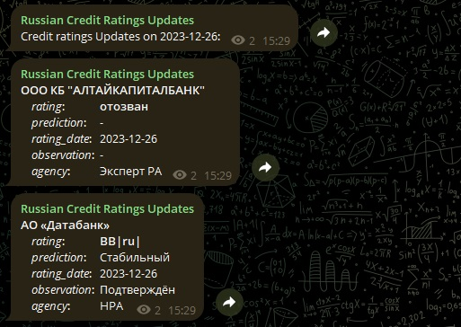
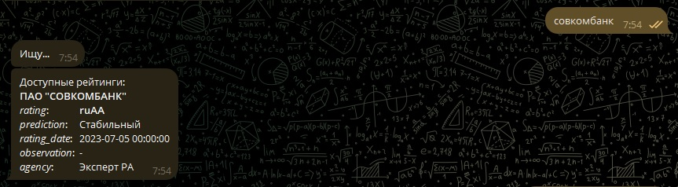
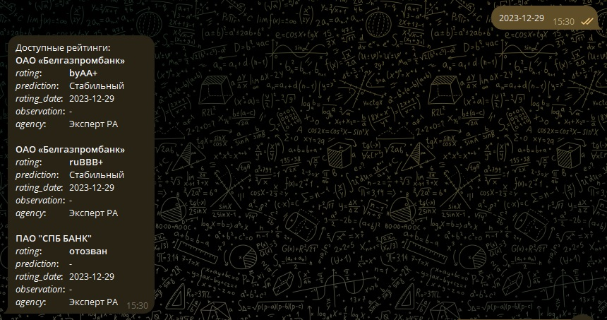

# Российские кредитные рейтинги
Сервис работает с данными, полученными с сайтов российских рейтинговых агентств, и позволяет получать обновления при изменении рейтингов, а также по запросу выводить рейтинги того или иного банка.

**Агентства**: [Эксперт РА](https://raexpert.ru/), [НРА](https://www.ra-national.ru/), [НКР](https://ratings.ru/)

**Scope покрытия рейтингов**: *банки и финансовые организации*

## Практическая полезность - *для чего сервис?*
**Кредитный рейтинг** - это мнение рейтингового агентства относительно общей кредитоспособности заемщика или кредитоспособности заемщика в отношении конкретных долговых обязательств, основанное на оценке факторов риска.
Основное предназначение подобных оценок — дать потенциальным кредиторам / вкладчикам представление о вероятности своевременной выплаты взятых финансовых обязательств.

Кредитные рейтинги, выставляемые рейтинговыми агентствами, могут использоваться в таких сферах как:
* Финансы, 
* Банковское управление 
* Риск-менеджмент и пр.
Контроль за кредитными рейтингами своих заемщиков, контрагентов и кредиторов позволяет контролировать количество и объемы операций проводимых с организациями.

В некоторых операциях, в частости в банковской деятельности, рейтинги должны обновляться как можно чаще, чтобы отрегулировать размеры и объемы потенциальных либо текущих кредитных, рыночных и торговых операций с тем или иным контрагентом. В связи с чем, сервис по live-мониторингу кредитных рейтингов может быть очень даже полезен.

Также стоит отметить актуальность получения данных от российских рейтинговых агентств из-за ухода с рынка зарубежных.

## Регулярная загрузка и обработка данных - *как работает?*
Под DAG в Airflow (*credit_ratings_ru_dag*) заложен следующий алгоритм:
1. Парсинг сайтов рейтинговых агентств
2. Фильтрация только новых записей среди полученных данных (дата выставления рейтинга >= дате запуска)
3. Передача данных в hdfs (parquet)
4. Обработка данных в таблицу в бд MySQL
5. Передача сообщений в тг-канал об обновлении в рейтингах

## UI - *как видеть результаты и получать нужные данные?*
* В телеграм канал [Russian Credit Ratings Updates](https://t.me/ru_credit_ratings_channel) каждый день приходят обновления с новостями об изменении/присуждении/отзыве рейтингов либо об отсутвии данных новостей

* Бот [RU Credit Ratings Bot](https://t.me/ru_credit_ratings_bot) умеет по названию банка находить все доступные для данной организации рейтинги, а также по дате находить все опубликованные в этот день рейтинги

## Компоненты системы
* selenium, bs4 - парсинг данных сайтов агентств
* Hadoop, Spark - хранение и обработка данных
* Airflow - регулярная загрузка и обработка данных + передача сообщений об обновлении в рейтингах
* telebot - чат-бот в телеграме для получения данных о рейтинге
* Datalens - дашборд всех накопленных данных о рейтингах
